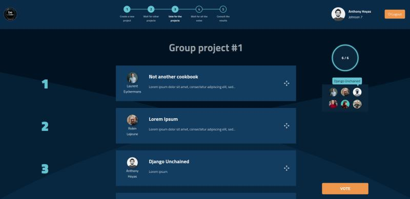
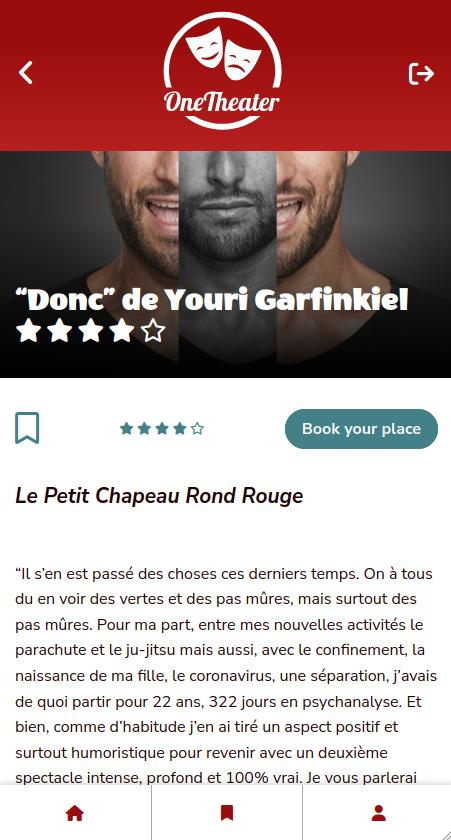
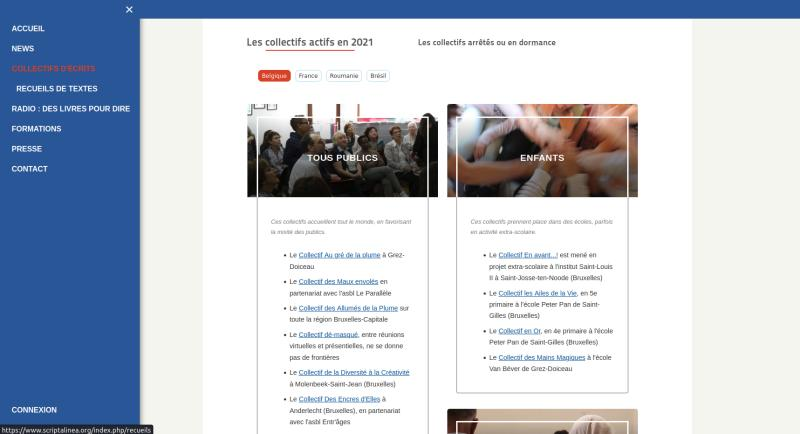
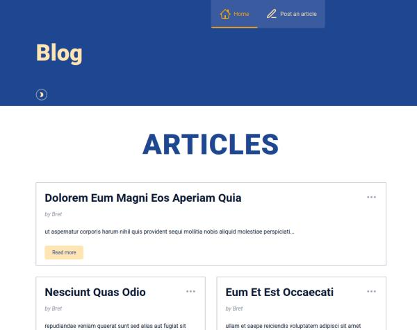

# Robin Lejeune

*Junior Web Developer based in Belgium*

[LinkedIn](https://be.linkedin.com/in/robinlejeune) /// [Github](https://github.com/robinlej/) /// [Dev.to](https://dev.to/robinlej)

---

## **CONTENTS**
1. <a href="#skills">Key skills</a>
2. <a href="#about">About</a>
3. <a href="#projects">My projects</a>
4. <a href="#experience">Experience</a>
5. <a href="#education">Education</a>
6. <a href="#languages">Languages</a>

---

## 💻 **KEY SKILLS**

| **FRONTEND** |  **BACKEND** |    **OTHER**   |
| ------------ | ------------ | -------------- |
| JavaScript   | NodeJS       | Git            |
| Typescript   | Express.js   | Figma          |
| React        | Nuxt         | Regex          |
| Vue.js       | SQL          | SEO            |
| CSS / SCSS   | MongoDB      | Linux commands |
| HTML         |              |                |

*Also worked with:* Django (Python), Next.js, Kotlin

## ℹ **ABOUT**

Changing careers after 7-months training in fullstack development and an internship as a Web App Developer at [HeartKinetics](https://heartkinetics.com/), I am a **Junior Web Developer** looking for an opportunity in Belgium.

After working in communications for the past 6 years and a few months of self-learning in JavaScript / HTML / CSS, I joined the **bootcamp on Web Development from BeCode** at the beginning of 2022. Their philosophy of active learning worked very well for me: it calls for our own motivation to keep improving and at the same time guides us towards the technologies that we should be looking into. It also gave me the opportunity to work on projects with others. During my internship at HeartKinetics, I was in charge of creating a dashboard for internal use displaying aggregated research data, which involved work with Vue.js / Nuxt and Plotly on the frontend, Kotlin on the backend.

Interested in accessibility issues.

## 🔬 **PROJECTS**

*NB: most projects have a GIF preview in their Readme file to help you visualise them.*

### ***1. Main projects***

- *Dashboard for HeartKinetics* - Frontend in Vue with Nuxt, backend in Kotlin
  
  > *No preview available due to its confidential nature.*
  > 
  > Dashboard displaying and aggregating research data (patients, genders, BMI, heart conditions, evolution over time...).
  > 
  > Work done: sketch on **Figma**, components and CSS with **Vue.js** in **Nuxt**, graphs with **Plotly**, custom endpoints in a REST API in **Kotlin**.

- [*BeTogether*](https://github.com/robinlej/betogether) - Frontend in React *(team of 2)*
    
    > [Demo](https://betogether-becode.herokuapp.com/)
    >
    > Desktop web app to allow BeCode learners to submit project ideas, see each others' projects and vote for their favorites. Creates groups according to the learners' preferences.

    
  
- [*OneTheater*](https://github.com/charlottelotte2021/OneTheater_app) - Frontend (vanilla) and Backend (Express) *(team of 3)*

  > [Demo](https://onetheater.herokuapp.com/) (mobile only)
  > 
  > Mobile web app to list all the theatre plays in Brussels according to their dates, names, theatre, comedians and keep them in a wishlist if interested.
  > 
  > The idea came from the lack of easy solutions to compare the seasons between theatres, making it a requirement to go on each theatre's website to check, compare, book.
  > 
  > The actual data was [scraped from the websites of the theatres](https://github.com/robinlej/scraping-fiesta-onetheater) using Playwright.

  

- [*ScriptaLinea*](https://www.scriptalinea.org) - Frontend components (CSS / vanilla JS) and connexion to the MySQL database with small PHP scripts

  > ScriptaLinea is the association for which I was working before operating my career change. In the 2 years there, I created a few components to improve the UI of the website: 
  > - a tag-based selection to sort the books published, 
  > - tabs for the radio episodes, 
  > - modal cards for the presentation of collectives (with integration of WCAG recommendations for accessibility), 
  > - a carousel with the latest news on the front page, 
  > - a better menu bar, 
  > - ... and lots of CSS tweaks here and there.

  

### ***2. Exercise projects***

- [*CRUD React App*](https://github.com/robinlej/tapio-posts) - React

  > Demo on https://robinlej.github.io/tapio-posts/
  > 
  > Full CRUD app made in 2 days as an exercise, using fake data from JSONPlaceholder and local storage for persistence.
  > 
  > - Responsive (mobile-first)
  > - Dark mode with toggle
  > - Attention to accessibility 

|  |  |
|---|---|

- [*RecipeApp*](https://github.com/robinlej/recipe-app) - JS / NodeJS / SQLite

  > Fullstack app in Javascript that connects to an API, to save some recipes and modify them. Made to practice a fullstack app and CRUD operations.

- [*MyMovies*](https://github.com/robinlej/MyMovies) - JS / SQLite

  > API call and basic DB management with SQLite

- [*Amazeing*](https://github.com/robinlej/amazeing) - JS

  > Maze in Javascript with game-like interactions (moves, levels, winning condition)

- [*Calculator*](https://github.com/robinlej/calculator-js) - JS / CSS

  > A calculator using Javascript and regex. Basic CSS.

- [*V-Card*](https://github.com/robinlej/v-card) - CSS
  
  > Responsive one-page layout

- [*JS DOMondrian*](https://github.com/robinlej/js-domondrian) - JS
  
  > Generates a random Mondrian-like painting every second

## 👩🏼‍💻 **EXPERIENCE**

**Fullstack Web App Developer Intern** @ [HeartKinetics](https://heartkinetics.com) *(August 2022 - September 2022)*

Start-up in the health sector developing an app to detect heart failures in patients.

  - Dashboard for the internal website displaying aggregated research data.
  - Frontend with Vue.js and Nuxt
  - Backend with Kotlin (add custom endpoints within an existing REST API)

**Web Developer Trainee** @ [BeCode](https://www.becode.org) *(Jan 2022 - July 2022)*
  
Bootcamp with an active learning philosophy

- Learned most of my skills and did most of my projects there (see previous sections)

**Communications Coordinator** @ [ScriptaLinea](https://www.scriptalinea.org) *(Nov 2019 - Nov 2022)*

Non-profit organization active in lifelong learning, publish 

  - Managing the website of the association, with updates in JavaScript, HTML, CSS, PHP, MySQL, and day-to-day management of the website host
  - Creating communications on social media, on the website, in print (flyers, posters) : writing, images, layout
  - Editing books (collections of short stories) with InDesign and coordinating the print job
  - Writing and designing the monthly newsletter
  - Coordinating meetings with several working groups
  - Setting up a communications strategy for the association

**Communications Officer** @ [Samyn and Partners](https://samynandpartners.com) *(Feb 2017 - Apr 2019)*

Architects

  - Digital management: website (WordPress) and social media (LinkedIn, Facebook, Instagram)
  - Layout for projects presentations
  - Managing a team of interns

**Communications and Marketing Officer** @ [Avitour](http://www.avitour.travel) *(May 2016 - Sept 2016)*

Grouping of travel agencies

  - Managing contents on the websites (Joomla!)
  - Creating newsletters & coordinating the people involved
  - Creating communication material
  
**Sales Administrative Support Officer** @ [Ricoh](https://www.ricoh.com) *(Mar 2015 - May 2016)*

  - Manage the administrative steps after the signature of new contracts or help in preparing them (calculations, daily contacts with the clients on the phone or by email, control of the sales offer)
  - Handle the clients' complaints, find a solution to satisfy both parties
  - Mainly Dutch working environment

## 👨‍🎓 **EDUCATION**

**7-month intensive Fullstack Web Development Bootcamp** @ [BeCode](https://www.becode.org) *(Jan 2022 - July 2022)*

**1-month SEO training** with [AdSem](https://agence.adsem.be/) *(June 2019)*

**Master's Degree** in Multilingual Business Communications *(English / Dutch)* @ [UCLouvain](https://www.uclouvain.be) *(2012 - 2014)*

**Bachelor's Degree** in Modern Languages and Literatures *(English / Spanish)* @ [UCLouvain](https://www.uclouvain.be) *(2009 - 2012)*
  - 6-month exchange to [Universidad Complutense de Madrid](https://ucm.es/english) *(2011-2012)*

## 💬 **LANGUAGES**

- **French** - *Native* (C2)
- **English** - *Bilingual* (C1)
- **Dutch** - *Professional Proficiency* (B2+)
- **Spanish** - *Professional Proficiency* (B2)